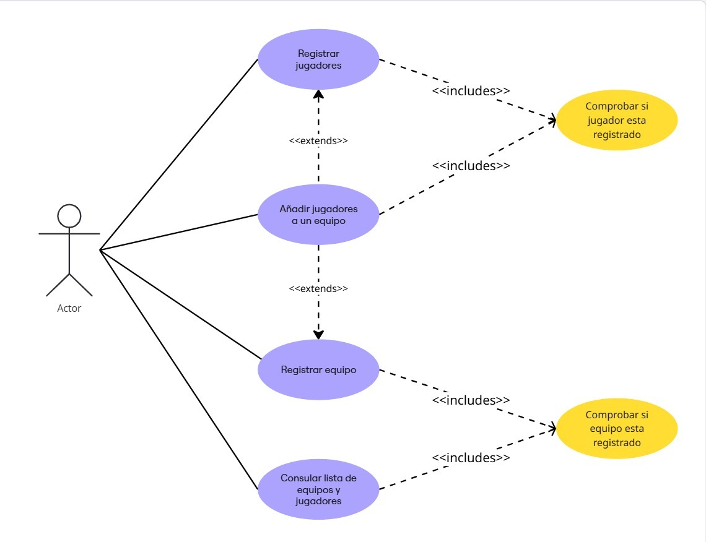
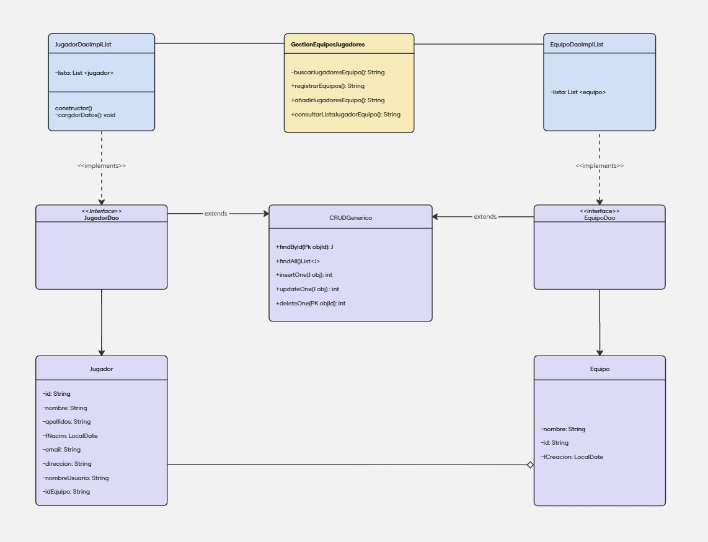

# Sistema de Gestión de Torneos de eSports 

## Autor 
Ángela Carballo Santamaria

Estudiantenpracticas

## Descripción del Proyecto 
Este proyecto forma parte de la asignatura Entornos de Desarrollo y tiene como objetivo la creación de una aplicación de gestión de torneos de eSports.

La tarea busca afianzar los conocimientos de UML y el paradigma de programación orientada a objetos. Para ello, se han diseñado:

Un diagrama de clases.

Un diagrama de casos de uso.

Estos diagramas representan la parte de gestión de equipos y jugadores dentro de la aplicación.

Tras analizar el enunciado, se identificaron:

Un actor principal: el Administrador.

Dos entidades: Equipo y Jugador.

## Diagramas UML 
### Diagrama de Casos de Uso 

 
### Diagrama de Clases 

## Justificación del diseño
Durante el planteamiento de los diagramas, se definieron los siguientes casos de uso:

Registrar jugadores.

Añadir jugadores a un equipo.

Consultar la lista de equipos.

Consultar la lista de jugadores.

Aunque el registro de jugadores no estaba explícitamente indicado en el enunciado, decidí incluirlo por coherencia: al igual que se permite registrar equipos y añadir jugadores a equipos, debería contemplarse también registrar a los propios jugadores.

Además, propuse dos casos adicionales:

Comprobar si un jugador está registrado.

Comprobar si un equipo está registrado.

Estos casos sirven para:

Evitar registrar elementos ya existentes.

Evitar añadir a equipos o jugadores que no existen en el sistema.

También observé una relación de herencia entre los casos de registro y el de añadir jugadores a un equipo, ya que estos podrían compartir métodos comunes.

Respecto a los actores, únicamente se identificó la figura del Administrador; no se encontraron otros roles relevantes para este sistema.

## Conclusiones  
Este proyecto ha sido de gran utilidad para:

Comprender mejor el uso de UML y la representación gráfica de los sistemas.

Entender el paradigma de orientación a objetos de manera más visual y estructurada.

Mejorar la organización del código en capas, entendiendo mejor el rol de cada componente dentro de un proyecto real.